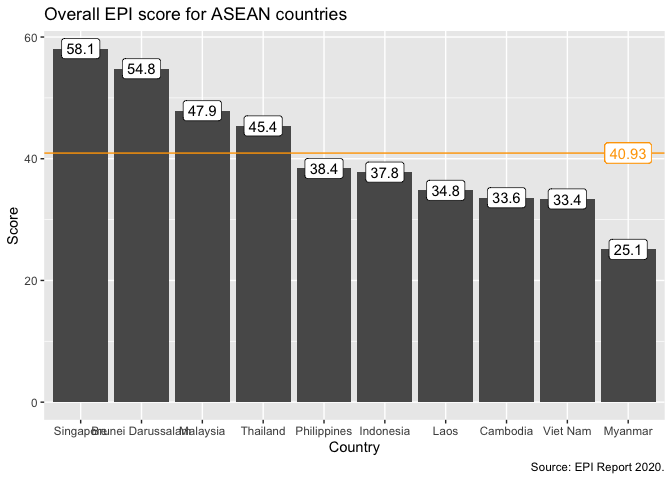
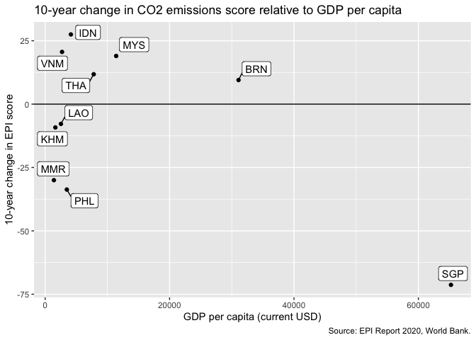

## Introduction

The Environmental Performance Index is a composite index factoring in many environment-related variables. The index' objective is to show how different countries evolve and whether globally we are moving in the right direction for the environment. 

## Overall EPI score for ASEAN countries

Looking at ASEAN countries as a group, the most recent respective EPI scores for each are shown in the chart below, ranked from highest to lowest. The maximum score is 100, and the orange line shows the average score for ASEAN as a whole (40.9). Malaysia scores slightly better than average. 

<!-- -->

In isolation, these scores do not tell us much. There is also a strong correlation between the EPI score and economic development, which the chart below shows (using GDP per capita as a proxy for economic development). This chart puts in context Singapore's high score, and shows that Malaysia does reasonably well, given its level of development. 

<!-- -->

Another useful metric to look at is the change in the EPI score over the last ten years, again in relation to GDP per capita. This shows more clearly which countries are moving in the right direction, and highlights the bad performance of Singapore. Malaysia is among the countries improving its score the most, although just behind Vietnam. 

<!-- -->

## Growth rate of carbon dioxide emissions

Arguably the most important determinant of the overall EPI score is climate change, within which the biggest weight is given to the evolution of CO2 emissions. Mitigating climate change has acquired urgency and tracking countries' success in limiting their emissions, in line with the Paris agreement, is crucial to drive policy. The EPI contains a score for CO2 emissions that is based on the average growth over the last ten years. The scores for ASEAN are shown in the chart below. Malaysia also does better than average here, especially considering the data series end in 2017, and there has been substantial investment in clean energy since then. 

<!-- -->

Unsurprisingly, the growth (or reduction) of CO2 emissions is also linked to economic development, whereby more developed countries achieved greater success at reducing emissions than less developed countries. 

<!-- -->

Again, looking at the change in the last ten years compared to GDP per capita would be more instructive to gauge whether countries are on the right track. Here again, Malaysia performs relatively well compared to other countries, but it is notable that Indonesia and Vietnam improved more. 

<!-- -->

In the world context, Malaysia is not doing bad either, also considering ASEAN. 

<!-- -->

## Conclusion

Based on this brief dive into the EPI data, it seems we are making progress in addressing some of the drivers of climate change, but, as the EPI 2020 report also concludes, too slowly to meet the targets set out in the Paris accord. Malaysia has an opportunity here to double down on renewable energy. As highlighted in the REFSA Brief "[Stimulating the Green Economy](https://refsa.org/stimulating-the-green-economy/)," Malaysia currently only draws 3% of its total electricity production from renewables. Policies are in place to bring that to 10%, on the way to an overall target of 20% by 2025. Now is the time to boost that investment, with the opportunity to build back better on the back of the Covid-19 pandemic. Public investment in renewable energy infrastructure will not only have a favourable effect on emissions, it will also create significant amounts of good jobs and contribute to sustainable economic growth. 
