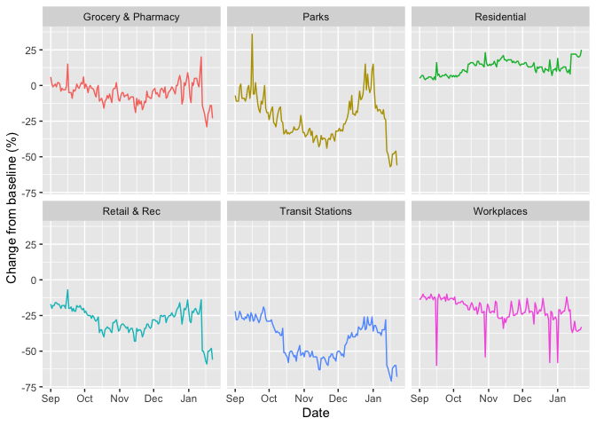
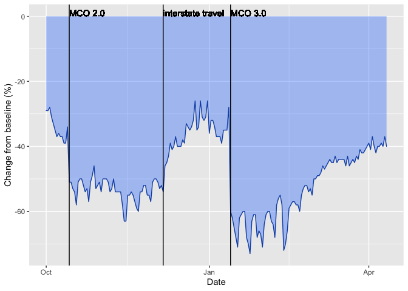
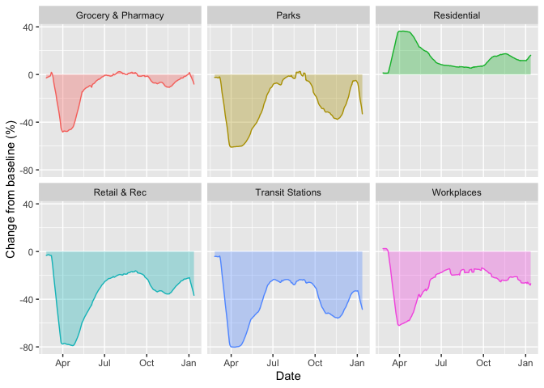

## Objective

Malaysia is currently struggling to deal with the third wave of the Covid-19 pandemic. This analysis aims to highlight a few data points that illuminate the response so far of the government, and where additional investment may be required. 

 1. Test positivity rate, and the need to perform more testing
 2. Changes in mobility, related to the positivity rate
 
## Test positivity rate

The test positivity rate is still quite elevated in Malaysia, above the minimum threshold recommended by the WHO (5%), and especially high compared to a successful country in managing Covid-19, South Korea. The following charts depict the evolution of number of new cases, number of tests, and positivity rate. All data is 7-day smoothed (rolling average); people tested are per 1,000 population; new daily cases are per million population.

Source: Our World In Data. 

<!-- -->

## Mobility
Analysis of mobility is based on Google's data for Malaysia. 
The charts below show the percent change compared to a baseline. The baseline is the median number of daily routing requests between early January to early February 2020. 

<!-- -->

The effect of the resumption of interstate travel on 2020-12-07 is well visible in the "Transit Stations" category. From that day there is a clear uptick in the number of requests for transit stations. Looking at that chart in isolation: 

<!-- -->

In order to see the trend better, we also compute a 7-day rolling average for the same data, across the whole data set. 

<!-- -->

## Test positivity rate vs mobility
The chart below shows the evolution of the test positivity rate and the mobility data related to transit stations. 

<!-- -->
