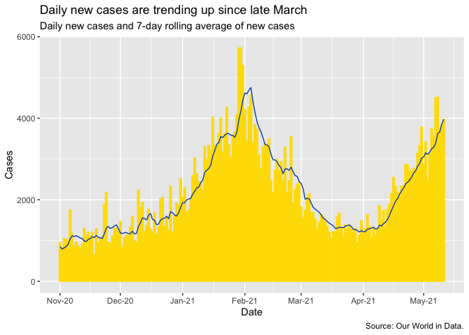
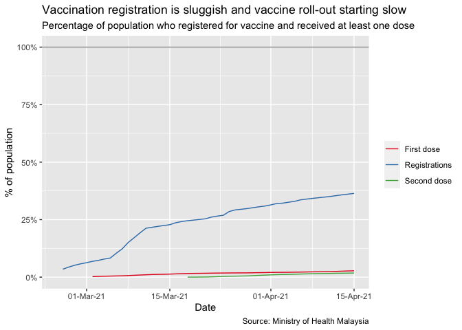
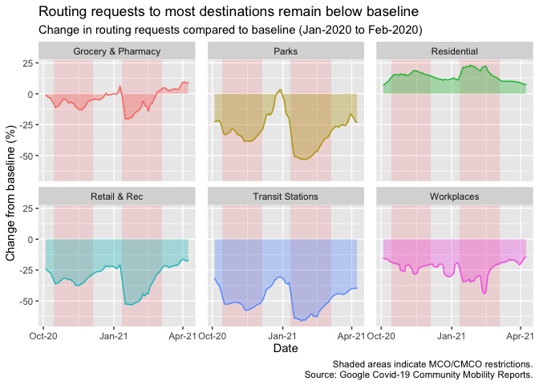
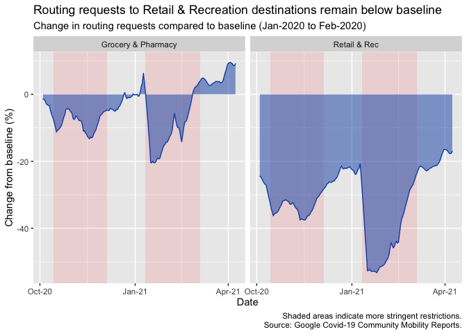
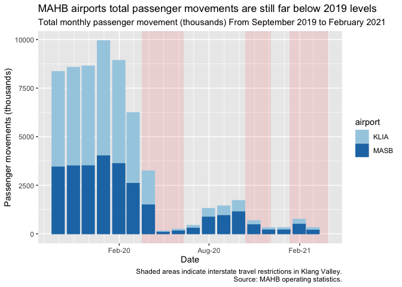
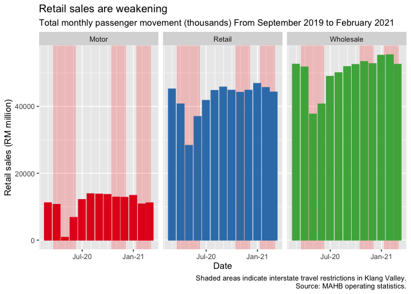
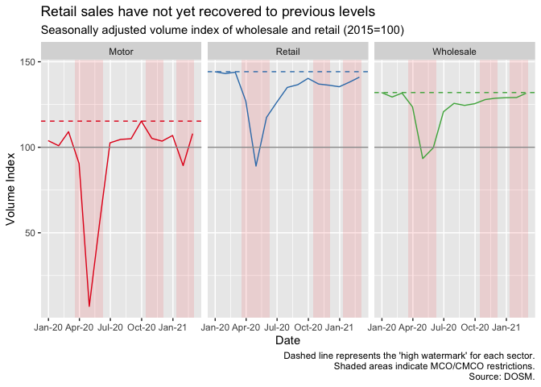

This tracker brings together a number of oft-referred to statistics to monitor the evolution of the Covid-19 pandemic in Malaysia, and highlight some interesting data points. As of now, the following data is included: 

 1. Daily count of tests, cases and test positivity rate
 2. Mobility data, based on Google's Covid-19 location data
 
## Daily new cases

<!-- -->

## Vaccinations

Our World In Data uses the metric "Share of people who have received at least one dose of Covid-19 vaccine." Adding in "Share of population registered for vaccination." 

<!-- -->

 
## Tests, cases and positivity rate

Source: Our World In Data. 

### Evolution of testing 

<!-- -->

### Evolution of daily cases

<!-- -->

### Evolution of test positivity rate

This rate shows the short-term positivity rate of tests. 

<!-- -->

## Mobility

Analysis of mobility is based on Google's data for Malaysia. 
The charts below show the percent change compared to a baseline. The baseline is the median number of daily routing requests between early January to early February 2020. 

### Change from baseline across categories

This chart shows the change in destinations relative to a pre-pandemic baseline, smoothed using a 7-day rolling average. Each time movement restrictions are announced, there is a noticeable drop in retail and recreation destinations as well as transit stations. 

<!-- -->

The effect of the resumption of interstate travel on 2020-12-07 is well visible in the "Transit Stations" category. From that day there is a clear uptick in the number of requests for transit stations. Looking at that chart in isolation: 

<!-- -->

For further analysis, we could look to include economic data (high frequency indicators would be best), and relate that to the evolution of the pandemic and the mobility data. 

<!-- -->

## Passenger movements at MAHB airports

Passenger movements data provide an insight into the health of the tourism sector. Judging by the most recent data, travel levels are still far below the average levels of 2019. 

<!-- -->
## Retail sales

Another leading indicator for economic performance, retail sales. 

<!-- -->

<!-- -->

